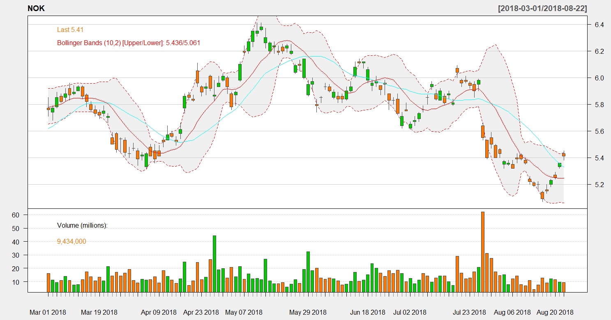

# NOKIA-Analysis

The [R software](https://www.r-project.org/) is one the most used tools by economists and data analysts of all kinds. Although it would be possible to achieve similar results by other means like Python's packages <em>BeatifulSoup</em>, R allows users to retrieve massive amounts of data from many different places with just a few lines of code using packages like [quantmod](https://cran.r-project.org/web/packages/quantmod/index.html) and [quandl](https://docs.quandl.com/). It's worth noting that most R packages are also available for other platforms, but in general and under this context, R's performance is superior. <br>

All project files can be found above:
- R source code files
- <em>xlsx</em> data files
- Sqlite3 database files
- <em>jpeg</em> plot images
- R binary data files


---


Founded in the mid-1800's, this Finnish Giant took Motorola's place at the end of the XX century and became the largest mobile phone
manufacturer in the world. Despite its enormous growth, Nokia wasn't able to keep its market share when other huge companies like Apple and Amazon started innovating the way technology is used.<br><br>

In recent years, Nokia attempted to regain some of its presence in the tech scene targetting more ambitious projects like virtual reality platforms and redesigning some of its old mobile phone models. After some struggle -- and the arrival of iOS and Android  -- its mobile phone division was eventually acquired by Microsoft. One year later, Nokia acquired its French counter-part <em>Alcatel-Lucent</em> for $15 billion, and even not being what it once was, they still are a key player in the development of technologies such as wireless services and mobile technologies as whole. 


<ul>
<li> This is a common data pattern for each trade computed and stored in the database:<br>
</ul>

|    DATE [0]    |    OPEN [1]    |    HIGH [2]    |     LOW [3]     |     CLOSE [4]    |     VOLUME [5]    |     ADJUSTED [6]     | 
|:--------------:|:--------------:|:--------------:|:---------------:|:----------------:|:-----------------:|:--------------------:|
|   2018-08-09   |     207.28     |     209.78     |      207.2      |      208.88      |  2 3 4 6 9 2 0 0  |        208.15        |

<br>


:arrow_right: Check out my other GitHub repository [Apple-Amazon-Google-Analysis](https://github.com/Rickyc14/Apple-Amazon-Google-Analysis.git) for a more in-depth clarification of the datatable description used in this project.


<br><br>
The graph below illustrates Nokia's <strong>closing stock price</strong> throughout the years. 


---


<br><br>
The graph <strong>below</strong> shows us a close-up of Nokia's stock price in the past six months. R's <em>simple moving average</em> function along with `chartSeries` allows for some <em>noise</em> reduction. In other words, anything that doesn't reflect the genuine underlying trend will be detached -- like reactive traders interfering with the stock's real value by acting on assumptions, and not on qualitative/quantitative factors.


<br><br>

<br><br>


Among the many types of <em>moving averages</em>, this project uses a <em>simple moving average(SMA)</em> with <strong>`n`</strong> being the number of periods to recursively average over. Basically, after taking the average of the first <strong>`n`</strong> values, the next average will be of all `n[n]` values from before, but dismissing the `n[0]` value and adding `n[n+1]`.
<br>

```r
addSMA(n=20,col="cyan")   # different colors to visualize the behavior of
addSMA(n=10,col="red")    # different ' n ' values by themselves AND as whole
```
It's very common to use different <strong>`n`</strong> values in the same data set as seen in the R functions above. They can be compared with each other to determine crucial aspects. For instance, choosing `n=50` and `n=200` is a very common approach, if the moving average of `n=50` remains above `n=200`'s moving average, then it's common to assume good returns from the investment.<br>
* As a general rule, if the price is above the moving average then the <strong>trend</strong> is <strong>up</strong>.<br>
        
        
```c
///   ---  C code to calculate all moving averages from a data set  --- 
///
/// if n = 10, then the values to be considered when calculating
/// each simple moving average would be the following:  
                                
#define data_size 1000                    /// note: when " i " gets to 991, simple_ma[991] won't have
float n[data_size];                         /// a 10th value as part of its sum_all
float sum_all;                                /// that's why this kind of procedure only makes sense
float simple_ma[data_size];                     /// when dealing with a large data set
for(int i = 0; i<data_size; i++)                
{
    sum_all = 0.0; /// sum_all must be set to zero before every SMA calculation
    for(int e = i; e < i+10;e++)
    {
      sum_all += n[e];                 /// n[e] can be viewed as the value in each ROW from 
    }                                    /// a specific COLUMN (e.g. CLOSE[4])
    simple_ma[i] = (sum_all/10);          /// in that case, data_size = number of ROWS in the CLOSE[4] COLUMN
}
```
