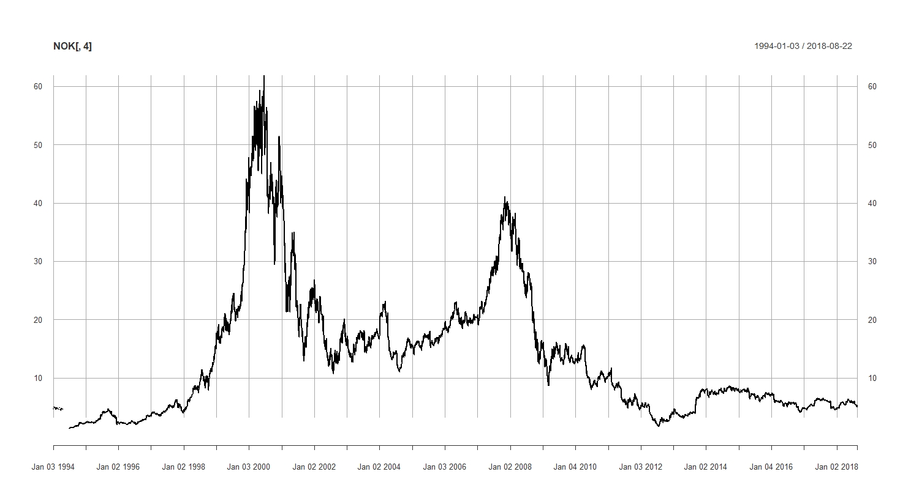

# NOKIA-Analysis

The [R software](https://www.r-project.org/) is one the most used tools by economists and data analysts of all kinds. Although it would be possible to achieve similar results by other means like Python's packages <em>BeatifulSoup</em>, with just a few lines of code R allows to retrieve massive amounts of data from many different places -- like [Yahoo finance](https://finance.yahoo.com/) -- and analyze it by plotting and/or checking relationships between values. 

All project files can be found above:
- R source code files
- <em>xlsx</em> dat files
- Sqlite3 data files
- <em>jpeg</em> plot images
- binary data files
  
This is a common data pattern for each trade computed and stored in the database:

|    DATE [0]    |    OPEN [1]    |    HIGH [2]    |     LOW [3]     |     CLOSE [4]    |     VOLUME [5]    |     ADJUSTED [6]     | 
|:--------------:|:--------------:|:--------------:|:---------------:|:----------------:|:-----------------:|:--------------------:|
|   2018-08-09   |     207.28     |     209.78     |      207.2      |      208.88      |  2 3 4 6 9 2 0 0  |        208.15        |

 

:arrow_right: Check out my other GitHub repository [Apple/Amazon/Google analysis](https://github.com/Rickyc14/Apple-Amazon-Google-Analysis.git) for a more in-depth exemplification of the datatable description used in this project.

  
Founded in the mid-1800's, this Finnish Giant took Motorola's place at the end of the XX century and became the largest mobile phone
manufacturer in the world. Despite its enormous growth, Nokia wasn't able to keep its market share when other huge companies like Apple
started to innovate the way technology is used.  
The graph below illustrates Nokia's <strong>closing stock price</strong> throughout the years. 

  
The graph below shows us a close-up of Nokia's stock price in the past six months. R's <em>simple moving average</em> method allows us to smooth stock spikes to get a better understanding of its future value.   

